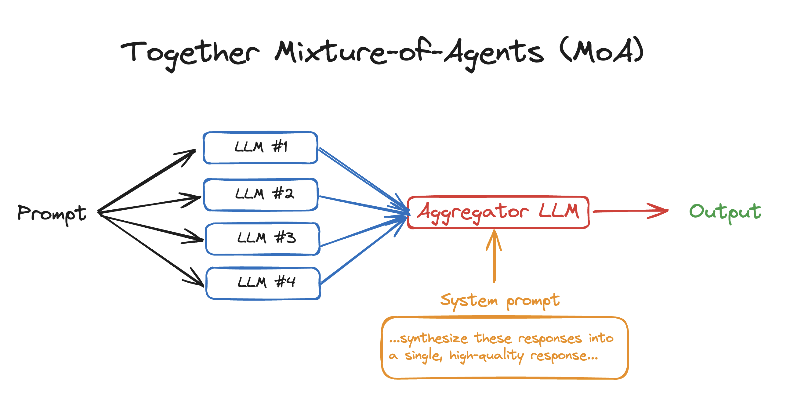

# Mixture-of-Agents (MoA)

[](https://arxiv.org/abs/2406.04692)


## Overview

**MoA(Mixture-of-Agents)** 는 여러 LLM의 집단적 강점을 활용하여 성능을 크게 향상시키는 혁신적인 방법입니다. 파인 튜닝 없이 프롬프트와 LLM 생성 인터페이스만으로 구현 가능하며, 여러 LLM의 협업을 통해 성능을 단계적으로 개선합니다. MoA의 핵심은 각 모델이 proposer와 aggregator 역할을 효과적으로 분담하는 협업 시스템에 있으며, 연구 결과에 따르면 모델 다양성과 proposer 수가 증가할수록 성능이 향상되어 단일 모델보다 우수한 성과를 냅니다.

## Quickstart
2개의 레이어와 3개의 LLM을 사용하는 간단한 MoA 예제가 2개 있습니다. 

1. HuggingFace Inference
    - Install the library `pip install transformers`
    - Run the python file: `python3 moa_hf.py`

2. vLLM Inference
    - Install the library: `pip install vllm`
    - Download OpenLLM model
      - ex. `git lfs clone https://huggingface.co/meta-llama/Meta-Llama-3.1-8B-Instruct`
    - Run the python file: `python3 moa_vllm.py`




*Source: [Together AI Github - Mixture-of-Agents](https://github.com/togethercomputer/MoA/blob/main/README.md)*


## Limitation
MoA 접근법의 주요 한계 중 하나는 첫 번째 토큰 생성 시간(TTFT)이 길어질 수 있다는 점입니다. MoA는 마지막 계층까지 모든 단계를 거친 후에야 첫 번째 토큰을 생성할 수 있어, 이 과정에서 TTFT가 증가할 수 있습니다.


## To do list
- [ ] advanced-moa 구현

## Citation
이 프로젝트는 다음 논문에서 제안한 Mixture-of-Agents 아키텍처를 구현합니다:

```
@article{wang2024mixture,
  title={Mixture-of-Agents Enhances Large Language Model Capabilities},
  author={Wang, Junlin and Wang, Jue and Athiwaratkun, Ben and Zhang, Ce and Zou, James},
  journal={arXiv preprint arXiv:2406.04692},
  year={2024}
}
```

Mixture-of-Agents 개념에 대한 자세한 내용은 [논문 원본](https://arxiv.org/abs/2406.04692) 및 [Together AI 블로그 게시물](https://www.together.ai/blog/together-moa)을 참조하세요.
